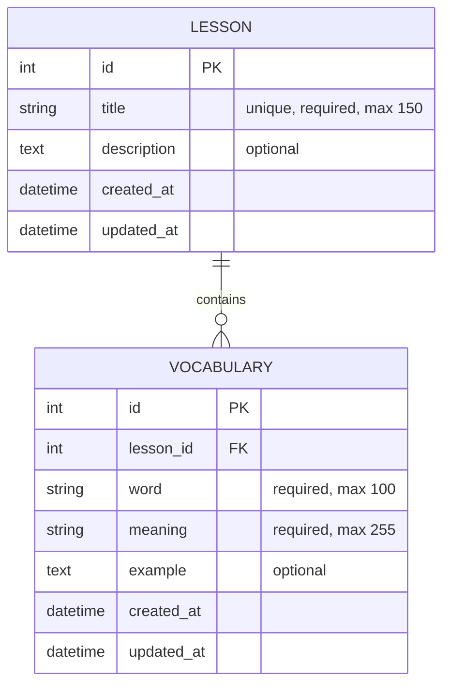

# English Janala - Backend

English Janala is a simple database-driven vocabulary learning app for Week 2 of a university Database Management System project. This backend uses Django, Django REST Framework, and SQLite.

## Technology Stack

- Django
- Django REST Framework
- SQLite
- django-cors-headers

## Project Structure

```text
english_janala_backend/
├── manage.py
├── requirements.txt
├── README.md
├── db.sqlite3
├── english_janala_backend/
│   ├── __init__.py
│   ├── asgi.py
│   ├── settings.py
│   ├── urls.py
│   └── wsgi.py
└── learning/
    ├── __init__.py
    ├── admin.py
    ├── apps.py
    ├── fixtures/
    │   └── sample_data.json
    ├── migrations/
    │   ├── __init__.py
    │   └── 0001_initial.py
    ├── models.py
    ├── serializers.py
    ├── urls.py
    └── views.py
```

## ER Diagram

Lesson (1) ----< Vocabulary (Many)

One lesson can contain many vocabulary words.
Each vocabulary word belongs to exactly one lesson.



## Database Table Structure

### lesson

- `id` - auto-generated primary key
- `title` - required, unique, maximum 150 characters
- `description` - optional text
- `created_at` - auto created timestamp
- `updated_at` - auto updated timestamp

### vocabulary

- `id` - auto-generated primary key
- `lesson_id` - foreign key to `lesson`
- `word` - required, maximum 100 characters
- `meaning` - required, maximum 255 characters
- `example` - optional text
- `created_at` - auto created timestamp
- `updated_at` - auto updated timestamp

### Constraints

- Lesson title must be unique.
- A vocabulary record must belong to one lesson.
- The combination of lesson and word must be unique.
- Delete endpoints are intentionally not included in Week 2.
- `lesson` uses `on_delete=PROTECT` so accidental removal is blocked until Week 3 decisions are made.

## Backend Setup Commands

### 1. Create virtual environment

Windows:

```bash
python -m venv venv
```

macOS/Linux:

```bash
python3 -m venv venv
```

### 2. Activate virtual environment

Windows PowerShell:

```bash
venv\Scripts\Activate.ps1
```

Windows Command Prompt:

```bash
venv\Scripts\activate
```

macOS/Linux:

```bash
source venv/bin/activate
```

### 3. Install dependencies

```bash
pip install -r requirements.txt
```

### 4. Run migrations

```bash
python manage.py migrate
```

### 5. Create a superuser

```bash
python manage.py createsuperuser
```

### 6. Start the Django server

```bash
python manage.py runserver
```

## SQLite Database Setup

SQLite is configured in `english_janala_backend/settings.py`. After running migrations, Django creates `db.sqlite3` in the backend folder.

## API Documentation

Base URL: `http://127.0.0.1:8000/api/`

### Lessons

| Endpoint                           | Method | Description                      |
| ---------------------------------- | ------ | -------------------------------- |
| `/lessons/`                        | GET    | Return all lessons               |
| `/lessons/`                        | POST   | Create a lesson                  |
| `/lessons/{id}/`                   | GET    | Return one lesson                |
| `/lessons/{id}/`                   | PUT    | Fully update one lesson          |
| `/lessons/{id}/`                   | PATCH  | Partially update one lesson      |
| `/lessons/{lesson_id}/vocabulary/` | GET    | Return vocabulary for one lesson |

### Vocabulary

| Endpoint                      | Method | Description                               |
| ----------------------------- | ------ | ----------------------------------------- |
| `/vocabulary/`                | GET    | Return all vocabulary                     |
| `/vocabulary/`                | POST   | Create vocabulary                         |
| `/vocabulary/{id}/`           | GET    | Return one vocabulary record              |
| `/vocabulary/{id}/`           | PUT    | Fully update vocabulary                   |
| `/vocabulary/{id}/`           | PATCH  | Partially update vocabulary               |
| `/vocabulary/search/?q=apple` | GET    | Search by English word or Bengali meaning |

### Vocabulary Response Fields

The vocabulary API includes the lesson title in the `lesson_title` field.

### Expected Validation Errors

- Missing required fields return `400 Bad Request` with field-level JSON errors.
- Duplicate lesson titles are rejected.
- Duplicate words inside the same lesson are rejected.
- Invalid IDs return `404 Not Found`.

## Sample Data

Load the fixture after migrations:

```bash
python manage.py loaddata sample_data
```

The fixture includes sample lessons:

- Greetings
- Family
- Food

And sample vocabulary for each lesson.

## API Testing Instructions

Use any Postman-compatible REST client.

1. Start the Django server.
2. Send `GET http://127.0.0.1:8000/api/lessons/`.
3. Send `POST http://127.0.0.1:8000/api/lessons/` with JSON like:

```json
{
  "title": "Daily Routine",
  "description": "Vocabulary about everyday activities."
}
```

4. Send `POST http://127.0.0.1:8000/api/vocabulary/` with JSON like:

```json
{
  "lesson": 1,
  "word": "Hello",
  "meaning": "হ্যালো / অভিবাদন",
  "example": "Hello, how are you?"
}
```

5. Test `PUT` and `PATCH` on lesson and vocabulary detail endpoints.
6. Test `GET /api/vocabulary/search/?q=হ্যালো`.

## Week 2 Testing Checklist

1. Create a valid lesson.
2. Reject an empty lesson title.
3. Reject a duplicate lesson title.
4. View all lessons.
5. View one lesson.
6. Update a lesson.
7. Create valid vocabulary.
8. Reject vocabulary without a lesson.
9. Reject vocabulary without a word.
10. Reject vocabulary without a meaning.
11. Reject duplicate vocabulary inside the same lesson.
12. View all vocabulary.
13. View vocabulary by lesson.
14. View word details.
15. Update vocabulary.
16. Search by English word.
17. Search by Bengali meaning.
18. Show no-results message.
19. Test responsive forms.
20. Test API using Postman.

## Screenshots Section

Insert screenshots here later:

- Home page
- Lesson list page
- Add lesson form
- Edit lesson form
- Vocabulary list page
- Add vocabulary form
- Edit vocabulary form
- Word details page
- Postman API tests

## Week 2 Completion Summary

Week 2 completed:

- ER diagram
- Table design
- SQLite database
- Django models
- REST API
- React interface
- Basic forms
- Create, View, and Update operations
- Frontend form testing

Still remaining for Week 3:

- Delete operation
- Full authentication and role permission
- Final validation improvements
- Complete testing and debugging
- Final styling
- Final report
- Deployment preparation
